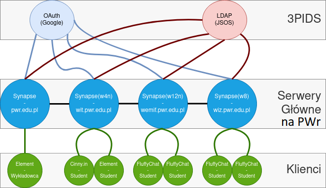

# Monolityczna Implementacja
Jednym ze sposobów fizycznej implementacji jest stworzenie jednego domowego serwera (np `matrix.pwr.edu.pl`) i zagregowanie wszystkich użytkowników (studentów, wykładowców, innych pracowników uczelni).

**Zalety**

- Prostota implementacji
- Minimalizowanie zużycia zasobów
- Zcentralizowanie Administracji

**Wady**

- Ograniczna tolerancja na błędy oraz problemy z serwerem na poziomie protokołu/aplikacji - synapse(możliwe rozwiązanie na poziomie infrastruktury w zależności od wykorzystanych narzędzi

# Podział na wydziały/role
Alternatywnym modelem który można obrać jest podzielenie oddziałów/wydziałów na poszczególne serwery domowe co nie powinno stanowić większego problemu ze względu na założenia samego protokołu oczekujące decentralizacji serwerów.

**Przykłady podziałów:**

Przykład inspirowany podziałem e-mail'i:

- pracownicy serwer `<imię.nazwisko>:pwr.edu.pl`
- studenci `<indeks>:student.pwr.edu.pl`

podział na wydziały:

- np. `<indeks>:wit.pwr.edu.pl`

## Graficzny przykład podziału:

Na powyższej grafice możemy zaobserwować przykładową konfigurację tego typu. Na samej górze (3PID - Google oraz JSOS) widnieją stystemy tożsamości, z których korzystają wsztkie serwery domowe w celu uwierzytelnienia studentów. 

Następnie na środkowym polu (Serwery główne - Synapse) dzięki protokołowi matrix łączą się miedzy sobą pozwalając na łatwą komunikację między wydziałami oraz z pracownikami uczelni.

Pracownicy oraz Studenci natomiast łączyć się będą poprzez różnych dostępnych klientów (Klienci - Element, FluffyChat, itd.) co pozwoli im na łatwy dostęp do komunikacji. Taki układ pozwoliłby na zbalansowanie wykorzystanych zasobów między kilka serwerów logicznych i/lub fizycznych.

**Zalety**

- Replikacja danych oraz wysoka dostępowość

**Wady**

- Większe zużycie zasobów ze względu na replikację danych
- Problem: Jeden student - wiele wydziałów[^1]

Oczywistym faktem jednak jest fakt, iż istnieje możliwość studiowania jednego studenta na wielu wydziałach, co komplikuje to proponowaną konfiguracje, ponieważ otrzymałby on wtedy dwa adresy dla każdego wydziału. Ponadto problem ten nie ma oczywistego rozwiązania w samej specyfikacji protokołu poniżej zamieszczono link do najbardziej zbliżonego problemu opisanego na GitHub'ie ze specyfikacją.

[^1]: [GitHub/issue#246 - Decentralised user accounts](https://github.com/matrix-org/matrix-spec/issues/246)

# Wymagana minimalna specyfikacja serwera na PWr
**Procesor**
Intel Xeon-E 2136 - 6c/12t - 3.3GHz/4.5GHz
**Pamięć**
64GB DDR4 ECC 2666MHz
**Storage**
6× 960GB SSD NVMe Soft RAID
**Przepustowość do sieci publicznej**
1Gbit/s unmetered
**Przepustowość do sieci prywatnej**
1Gbit/s unmetered

