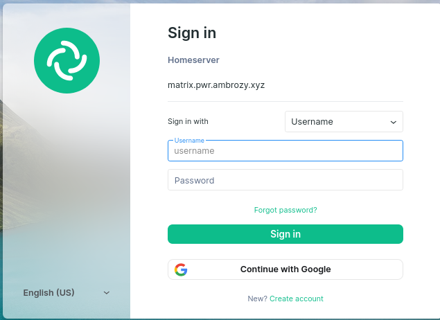

## OIDC

Do integracji z innymi systemami wykorzystaliśmy OIDC, ponieważ:

- jest już wykorzystywane przez politechnikę (Konta Google)
- Jest nowszym, bezpieczniejszym oraz łatwiejszym w użyciu protokołem w porównaniu z LDAPem

Ze względu na wykorzystanie przez politechnikę kont Google zdecydowaliśmy się na zintegrowanie ich również w naszej konfiguracji.

Wymagało to stworzenia projektu w [Konsoli Google Cloud](https://console.cloud.google.com/), można było do tego wykorzystać konto studenckie co pozwoliło na ograniczenie dostępu tylko dla ludzi z organizacji (z kontem \*.pwr.edu.pl).

Następnie w konfiguracji aplikacji należało wypełnić odpowiednie dane:
```yaml
matrix_nginx_proxy_proxy_matrix_client_api_forwarded_location_synapse_oidc_api_enabled: true
matrix_synapse_configuration_extension_yaml: |
  oidc_providers:
    - idp_id: google
      idp_name: Google
      idp_brand: "google"
      issuer: "https://accounts.google.com/"
      client_id: "<nazwa id klienta>"
      client_secret: "<sekret klienta>"
      scopes: ["openid", "profile", "email"] # email is optional, read below
      user_mapping_provider:
        config:
          localpart_template: "u{{ user.email.split('@')[0] }}"
          display_name_template: "{{ user.name }}"
          email_template: "{{ user.email }}"
```

Najważniejsze elementy tej konfiguracji to:

- client\_id oraz client\_secret - wygenerowane podczas tworzenia projektu w konsoli google
- localpart\_template - konfiguracja instruująca jak "zmapować" dane użytkowników na ID w matrixie

### Efekt końcowy

Dzięki temu na ekranie logowania możemy zaobserwować dodatkowe pole **Continue with Google** pozwalające nam zalogować się mailem studenckim/pracowniczym. Co ważne konto to nie musi istnieć na serwerze. Przy pierwszym logowaniu zostanie automatycznie stworzone.


