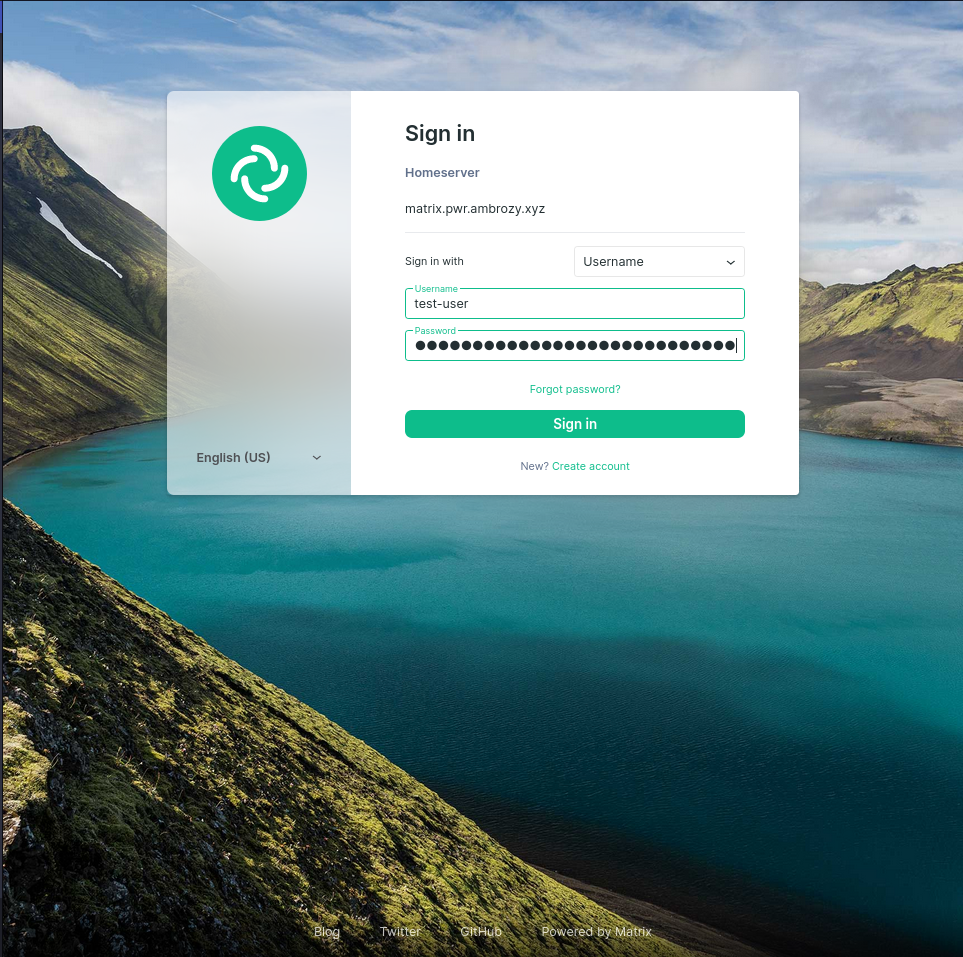

## Klient Mobilny

Do prezentacji wykorzystany został klient mobilny o nazwie [FluffyChat](https://fluffychat.im) na systemie Android. Dostępny jest on również na platformy: webowe, Linux, IOS.

Po wybraniu domowego serwera z wybranym adresem otrzymamy możliwość zalogowania. Ponieważ ze względów bezpieczeństwa rejestracja jest wyłączona oraz integracja z innymi systemami autoryzacji wybiega poza zakres symulacji posłużymy się kontem stworzonym w poprzednim kroku.

{width="250"}
{width="250"}

*Zdjęcie z ekranu telefonu: FluffyChat logowanie*

Po dołączeniu na serwer domowy mamy możliwość dołączenia do rozmów w kanałach czatowych oraz głosowych co można zaobserwować na obrazkach zamieszczonych poniżej

{width="250"}
{width="250"}

*Zdjęcie z ekranu telefonu: FluffyChat dołączanie do chatu*

## Klient Webowy

Następnie zostanie zaprezentowane logowanie za pomocą klienta webowego o nazwie [Element](https://element.io/). Proces jest identyczny do logowania za pomocą klienta mobilnego.

{width="300"}
{width="300"}

*Zdjęcie z ekranu przeglądarki: Element logowanie*

## Weryfikacja Logowania

Jednym z ważniejszych aspektów które gwarantuje protokół matrix jest tzw. [End to End Encryption](../metody-szyfrowania/#matrix_e2ee). W celu wykorzystania tego, klienci muszą sobie zauwać i wymienić się kluczami. Proces ten zaprezentowany jest poniżej.

{width="300"}
{width="300"}
{width="300"}
{width="300"}

*Zdjęcia z ekranu przeglądarki: Element weryfikacja urządzenia*
