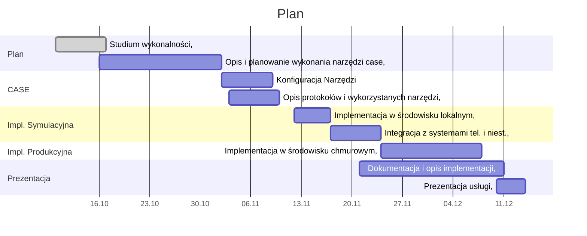

# Tabela

| Nr | Zadani                                               | Termin     | Czas Trwania |  
| -- | ---------------------------------------------------- | ---------- | ------------ |
| 1. | Studium Wykonalnośći                                 | 17.10.2022 | 1 tydzień    |
| 2. | Opis i Planowanie wykonania narzędzi CASE            | 02.11.2022 | 2 tygodnie   |
| 3. | Konfiguracja Narzędzi                                | 05.11.2022 | 1 tydzień    |
| 4. | Opis protokołów i wykorzystanch narzędzi             | 10.11.2022 | 1 tydzień    |
| 5. | Implementacja w środowisku lokalnym                  | 16.11.2022 | 5 dni        |
| 6. | Integracja z systemami teleinformatycznymi i niest.  | 23.11.2022 | 1 tydzień    |
| 7. | Implementacja w środowisku chmurowym (symulacja pwr) | 06.12.2022 | 2 tygodnie   |
| 8. | Dokumentacja i opis implementacji                    | 11.12.2022 | 4 tygodnie   |
| 9. | Prezentacja Działającej usługi                       | 14.12.2022 | 3 dni        |

# Wykres Gantta
<!--

-->

[](https://mermaid.ink/img/pako:eNqNk8-K2zAQxl9lEORmTOz9E_CtbFpYStpATgVfBktxtLYkI0u4zrKXfYuyj9FHaPNeHdlO4pY91BgzjDzf95uR9MwKwwXLWInaOci1k64WsK1R55qjE5-MVehgvY43m_gbPbnG77Kd0gseL1S8oCTQM35bUThp9KQRMjvnufQKur4yGmttTm-FjCDjRosIkmVMb7pM0whWfBL52sgWJDSkYTrUUkzFWiJotMffP_hRQoEtCWSYkMr9VWWZxkkyxH8TPXzYfRwzn43ey9JbLJ4Qvlz0Mtw7YSHorfgMpLHGmcqcXn_97IgqoNhj3zrUfXG48gSUYH9zto9Cb--RPKqmjmHXK19j0T9pHJdDWiih3cDVwenNGm462VYealPR6HoVTG6o30uPEdxNrI_aiXLs6Qgt8QmFSoIT5CWBhti6OJTfUvnqWp5078FtydpX_wlXHJS3phvpxhmSSfqP8NaK41Q_LqxN5S-KEsyw6TMbGWV4RzrJDJbidDbRmSb49vTqy2Eb7sdzlZ6rbs8xi5gSdHYlp0P_HDRy5g5kmLOMwlqWB5ezXL_Qj-id2fW6YJmzXkTMN-FGrCXSkBXL9ljT8WOCS2fsZrxGw216-QOKmhMc?type=png)
